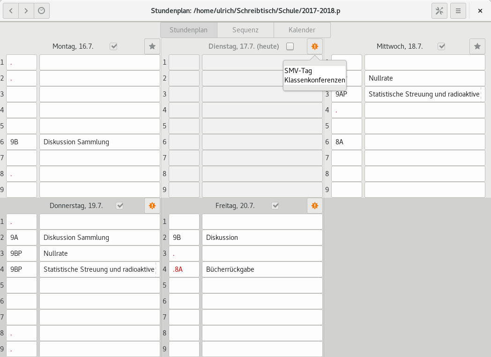
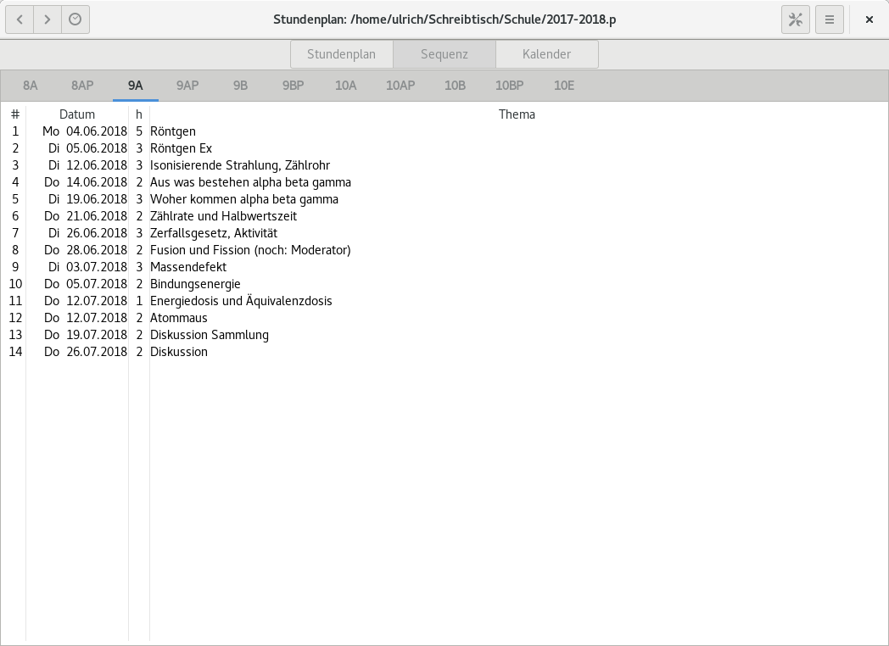

Overview
========

Timetable is a schedule for teachers targeting the gnome desktop.
Only using GTK and Python 3 as dependency, it can also be run from Windows or OSX easily.

It is under development and in trial. By now a German and an English language file exist. 

This is the timetable view.

This is the sequence view.

This is the calendar.

Install
=======

Windows
-------

You need Python and GTK+, which are not part of the Windows distribution. First install Python 3.4 from

.. https://www.python.org/ftp/python/3.4.0/python-3.4.0.amd64.msi

and simply click "next" until the installation has finished. Then GTK+ and bindings for Python are
avialable on:

.. https://sourceforge.net/projects/pygobjectwin32/files/latest/download

* Download the installer and run it.
* Since you have no portable Python installed, choose "no".
* Choose Python 3.4 for your Python installation.
* In the next dialog, you are asked for the packages you want to install. Only choose "Base Packages" (alredy marked) and "GTK+".
* No further dependencies are needed. Click "next" until the installation is finished.
* Download a copy of the master from

.. https://github.com/kaschpal/timetable/archive/master.zip

and extract it. The application can now be started by a double click on "timetable.py" 

Linux / other Unices
--------------------

If you dont't have an exotic distribution, GTK+ and Python 3 with PyGObject should be already installed. Simply
clone the repository with 

$ git clone https://github.com/kaschpal/timetable.git

or download the master from

.. https://github.com/kaschpal/timetable/archive/master.zip

and start the application by running

$ ./timetable.py

or

$ python3 timetable.py

If you run a special system with no GTK+ and/or Python 3 installed, I am pretty sure, you know what is necessary to
install the application.
